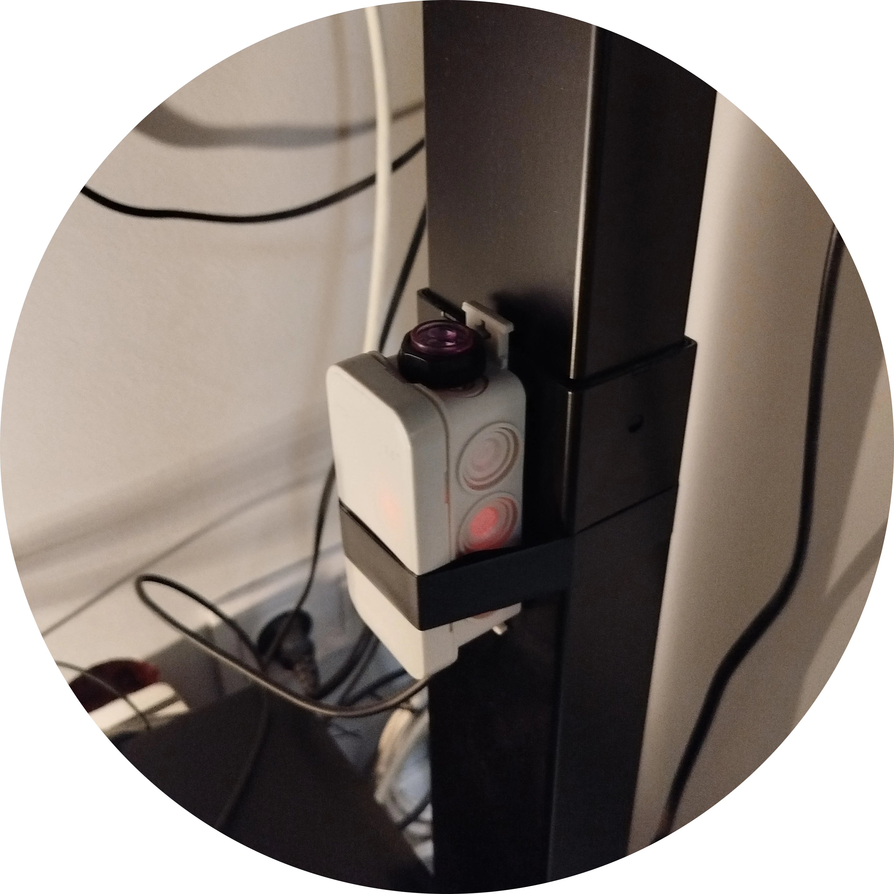

# ChairRorist

This is a simple Python app that connects to an Arduino with a distance sensor to track if your height-adjustable desk is up or down. It sits quietly in the system tray and reminds you to stand every hour.

More info [here](https://jakubkivi.github.io#portfolio-modal-ChairRorist)
